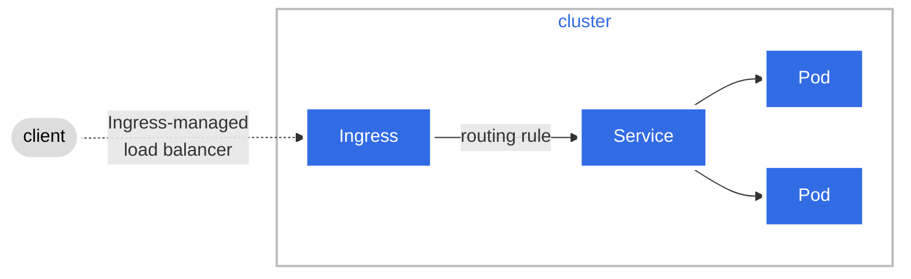
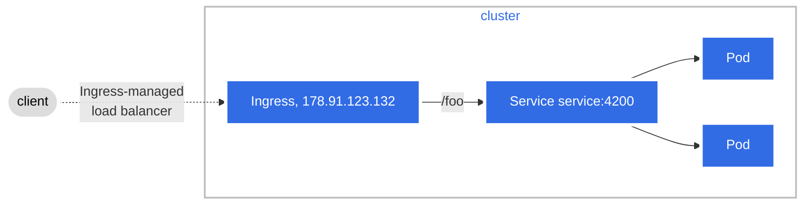
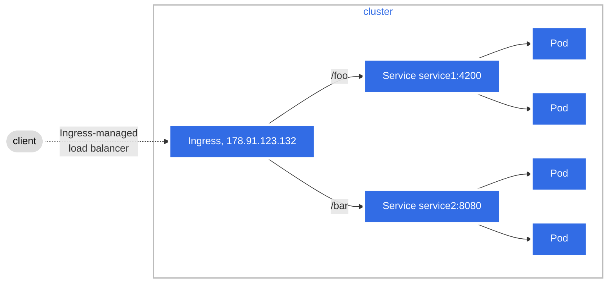
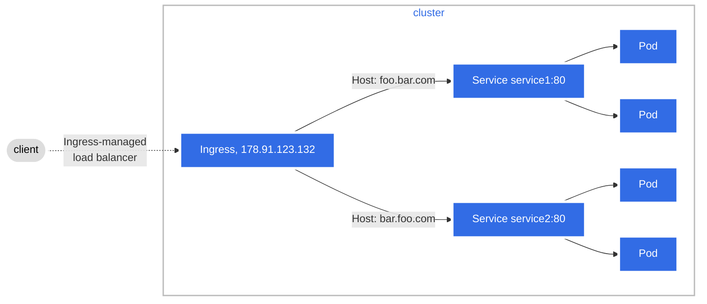

## What is Kubernetes Ingress?

- [Ingress](https://kubernetes.io/docs/reference/generated/kubernetes-api/v1.32/#ingress-v1-networking-k8s-io) exposes HTTP and HTTPS routes from outside the cluster to services within the cluster. Traffic routing is controlled by rules defined on the Ingress resource.
- It acts like a smart door manager that decides which request goes to which application based on factors like the URL's host name or path.

<br>

## Core Principles of Kubernetes Ingress
### Basic Architecture
At it heart, Kubernetes Ingress consists of two parts:
- **Ingress Resource**: This is a set of rules that define how to route external requests to your service.
- **Ingress Controller**: This is the software that reads the rules defined in the Ingress resource and actually directs the traffic accordingly.

#### Ingress Resource
- The Ingress resource is defined in a YAML file. This file includes rules that map incoming traffic (by host and URL path) to specific backend services running in your cluster.
- You might set up rules that send requests for www.example.com/api to one service and www.example.com/web to another. These rules tell Kubernetes how to direct the traffic.
- A minimal Ingress Resource example:

```yaml
apiVersion: networking.k8s.io/v1
kind: Ingress
metadata:
  name: minimal-ingress
  annotations:
    nginx.ingress.kubernetes.io/rewrite-target: /
spec:
  ingressClassName: nginx-example
  rules:
  - http:
      paths:
      - path: /testpath
        pathType: Prefix
        backend:
          service:
            name: test
            port:
              number: 80
```

#### Ingress Controller
- An Ingress controller is a program that reads the rules defined in your Ingress resources. It then configures a **load balancer** to make sure the traffic is sent to the right services.
- For example with [ingress-nginx](https://kubernetes.github.io/ingress-nginx/), the controller **automatically** creates a single load balancer (with one public IP) that serves all the Ingress resources it manages.
- However, other implementations or configurations can vary. For instance, cloud-specific controllers may allow you to configure individual load balancers per Ingress resource, depending on your architecture or security requirements.
- A [comprehensive list](https://kubernetes.io/docs/concepts/services-networking/ingress-controllers/#additional-controllers) of Ingress controllers.
- A [comparison](https://docs.google.com/spreadsheets/d/191WWNpjJ2za6-nbG4ZoUMXMpUK8KlCIosvQB0f-oq3k/edit?gid=907731238#gid=907731238) of various Ingress Controllers.

<br>

## Types of Ingress

### Ingress backed by a single Service
The ingress is serving a single service inside cluster.



- The client initiates a request that first reaches an ingress-managed load balancer. This load balancer is responsible for receiving external traffic and directing it into the cluster.
- The request enters the cluster through the Ingress.
- The Ingress is configured with rules, in this case a rule that matches request with the path `/foo`.

```yaml
apiVersion: networking.k8s.io/v1
kind: Ingress
metadata:
  name: test-ingress
spec:
  rules:
  - host: "example.com"
    http:
      paths:
      - path: /foo
        pathType: Prefix
        backend:
          service:
            name: test    
            port:
              number: 4200  
```
- This can also be achieved with an ingress by specifying a default backend with no rules.

```yaml
apiVersion: networking.k8s.io/v1
kind: Ingress
metadata:
  name: test-ingress
spec:
  defaultBackend:
    service:
      name: test
      port:
        number: 4200
```

### Simple Fanout

A Fanout configuration routes traffic from a single IP address to more than one Service, based on the HTTP URI being requested. An Ingress allows you to keep the number of load balancers down to a minimum.



- The client initiates a request that first reaches an ingress-managed load balancer.
- The request enters the cluster through the Ingress.
- The Ingress is configured with rules. The rules in this case are
    - request with path `/foo` are forwarded to `service1` service.
    - request with path `/bar` are forwarded to `service2` service.

```yaml
apiVersion: networking.k8s.io/v1
kind: Ingress
metadata:
  name: simple-fanout-example
spec:
  rules:
  - host: foo.bar.com
    http:
      paths:
      - path: /foo
        pathType: Prefix
        backend:
          service:
            name: service1
            port:
              number: 4200
      - path: /bar
        pathType: Prefix
        backend:
          service:
            name: service2
            port:
              number: 8080
```

### Name based virtual hosting
Name-based virtual hosts support routing HTTP traffic to multiple host names at the same IP address.



- The client initiates a request that first reaches an ingress-managed load balancer.
- The request enters the cluster through the Ingress.
- The Ingress is configured with rules. The rules in this case are
    - request with hostname `foo.bar.com` are forwarded to `service1` service.
    - request with path `bar.foo.com` are forwarded to `service2` service.

```yaml
apiVersion: networking.k8s.io/v1
kind: Ingress
metadata:
  name: name-virtual-host-ingress
spec:
  rules:
  - host: foo.bar.com
    http:
      paths:
      - pathType: Prefix
        path: "/"
        backend:
          service:
            name: service1
            port:
              number: 80
  - host: bar.foo.com
    http:
      paths:
      - pathType: Prefix
        path: "/"
        backend:
          service:
            name: service2
            port:
              number: 80
```

<br>

## Limitations of the Ingress API
- Ingress primarily supports TLS termination and basic, content-based HTTP routing
- Advanced routing features require non-standard, vendor-specific annotations. Every implementation has its own supported extensions that may not translate to any other implementation.
    - For example, to rewrite incoming URLs (for instance, changing `/old-path` to `/new-path`), implementations like ingress-nginx require a vendor-specific annotation such as `nginx.ingress.kubernetes.io/rewrite-target: /new-path`.
- The Ingress API is not well-suited for multi-team clusters with shared load-balancing infrastructure. With Ingress, tasks such as setting up and managing gateways (which are more relevant to platform engineering) are often handled by application developers. 